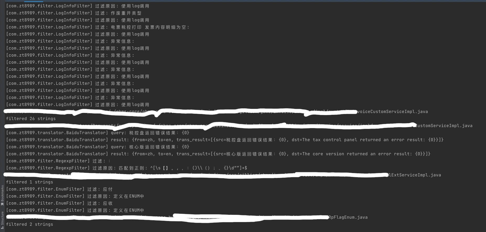

# kiwi-java

> kiwi-java是一个智能国际化java工程的一个工具，采用groovy编写

## 智能翻译

> kiwi-java使用ast解析完成翻译，可以识别以下内容并跳过翻译

* 注释
* log中的中文
* 配置文件中排除的中文
* 参与业务逻辑的中文比如 “中文”.equsals(“中文”)
* 正则匹配的中文字符（只包含标点）
* 存在于注解中的中文
* 存在于枚举的中文
* 注释中添加了kiwi-disable-method

## 智能转换

> kiwi-java可以将特定语法转换成适应国际化的语法
* 拼接的文案。"用户" + user.name + "不能为空"，会做占位符转换, 变成"用户{0}不能为空", 然后替换成对应的code
* 注解中的文案。 @NotNull(message = "用户不能为空")，替换成@NotNull(message = "{user_name_not_empty}")
* MessageFormat.format中的文案。MessageFormat.format("用户名{0}不能为空", user.name)替换成I18nUtils.getMessage("user_name_not_empty", new Object[]{ user.name })。
* 存在bug，暂时过滤。~~字段中的字符串。private static String abc = "你好"替换成~~
```java
private String getAbc(){
  return I18nUtils.getMessage("hello")
}
```

[原理介绍](https://zt8989.github.io/2022/06/02/%E5%90%8E%E7%AB%AF%E5%9B%BD%E9%99%85%E5%8C%96-kiwi-java%E7%AE%80%E4%BB%8B/)

## 使用方法

jdk版本 >= 11
1. 在java项目根目录创建配置文件`kiwi.yaml`
2. 使用以下命令完成翻译

```shell
java -jar kiwi-java.jar 
# 可选baseUrl,默认当前文件夹
java -jar kiwi-java.jar -baseUrl .
# 可选config,默认kiwi.yaml
java -jar kiwi-java.jar -baseUrl . -config ./kiwi.yarml
# 可选diffRef, 如果有则只对比git增量代码，解决存量项目中全量翻译测试量过大的问题
java -jar kiwi-java.jar -baseUrl . -config ./kiwi.yarml -diffRef develop
```



## 配置

```yaml
BAIDU_API_APP_ID: ****
BAIDU_API_KEY: ***

modules:
  - path: moduleA
    messageLocation: moduleA/subModuleB/src/main/resources/i18n/

i18nImportClass: com.example.I18nUtils

preLoadMessages:
  - "glob:**/src/main/resources/i18n/messages_zh_CN.properties"

fileExcludes:
  - "glob:**/Swagger2.java"

chineseExcludes:
  - "测试"
    
functionCallExcludes:
  - "log.*"
  - "logger.*"

joiner: _
prefix: biz.
```

| 字段                      | 解释                                                       |
|-------------------------|----------------------------------------------------------|
| BAIDU_API_APP_ID        | 百度翻译APP_ID                                               |
| BAIDU_API_KEY           | 百度翻译APP_KEY                                              |
| modules                 | 模块数组                                                     |
| modules.path            | 模块路径                                                     |
| modules.messageLocation | 模块消息路径                                                   |
| i18nImportClass         | i18N class位置                                             |
| fileExcludes            | 排除的java文件                                                |
| chineseExcludes         | 需要排除翻译的的中文                                               |
| preLoadMessages         | 预加载翻译资源，可以是其他模块下的资源                                      |
| joiner                  | 连接器，默认是_, abc_def                                        |
| prefix                  | 前缀，默认是空，biz.abc.efg                                      |
| functionCallExcludes                  | 方法请求过滤规则，默认过滤log.*, logger.*中的中文， 也可以自定义比如 dingding.send |

## 国际化工具类
国际化工具类必须实现这两个方法
```java
public final class I18nUtils {
    private I18nUtils() {
    }

    public static String getMessage(String code) {
        // TODO
    }

    public static String getMessage(String code, Object[] args) {
        // TODO
    }
}
```

## 排除翻译方式

### 文件级别

fileExcludes

### 常量中文

chineseExcludes

### 方法级别

在注释中添加kiwi-disable-method

```java
public class MethodExclude {
    /**
     * 这个方法跳过翻译
     * kiwi-disable-method
     * @param code
     * @return
     */
    public static String getMessage(String code) {

    }
}
```
